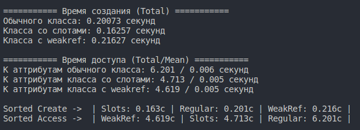
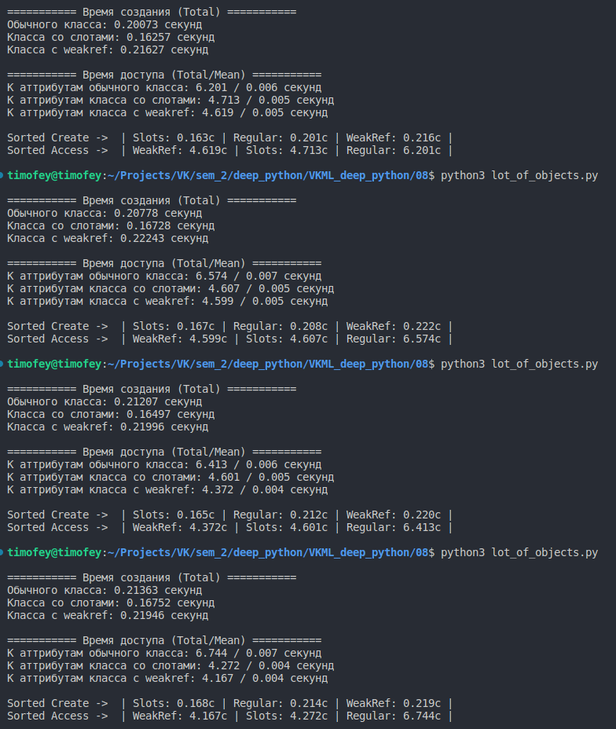
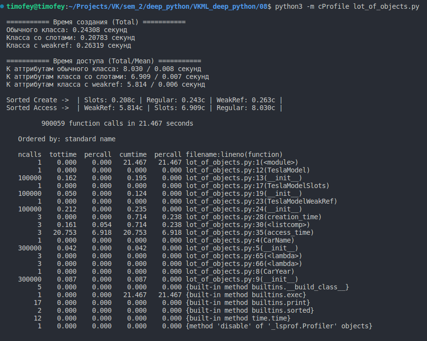
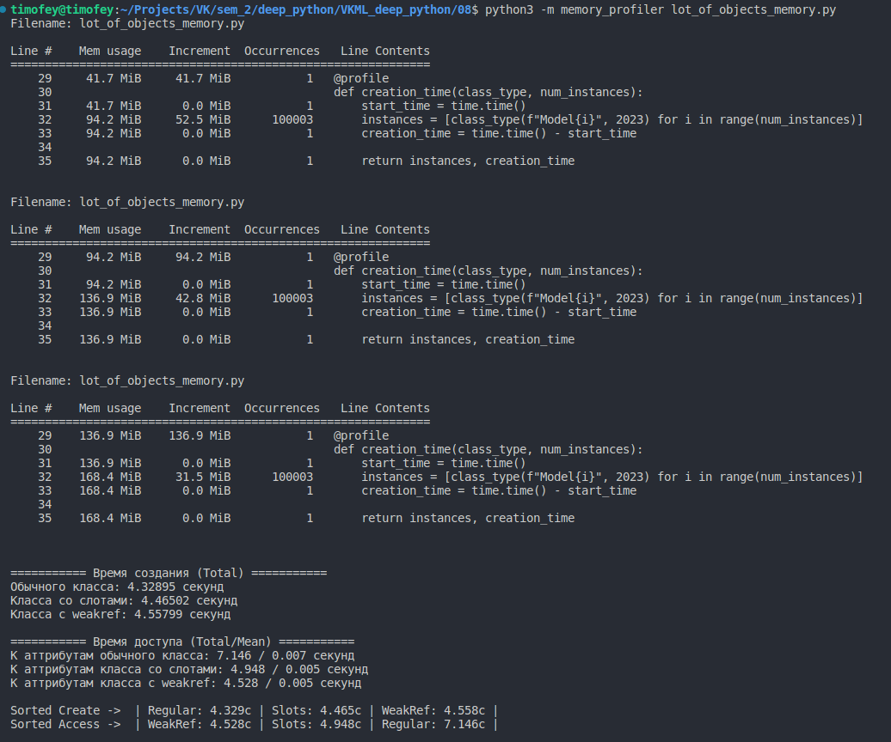
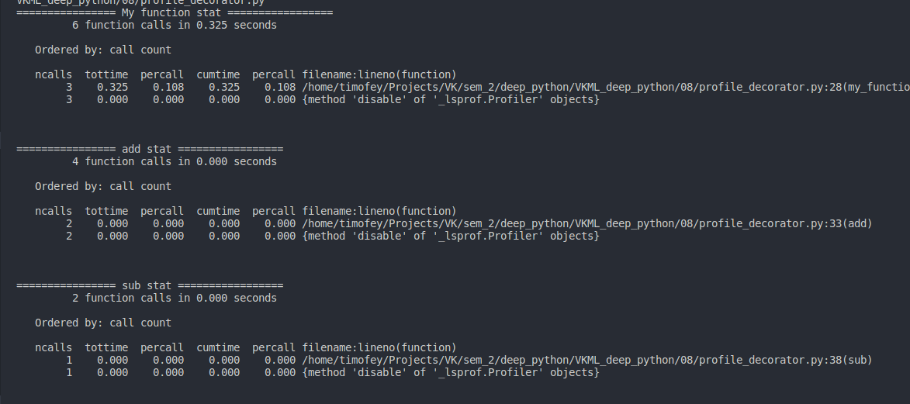
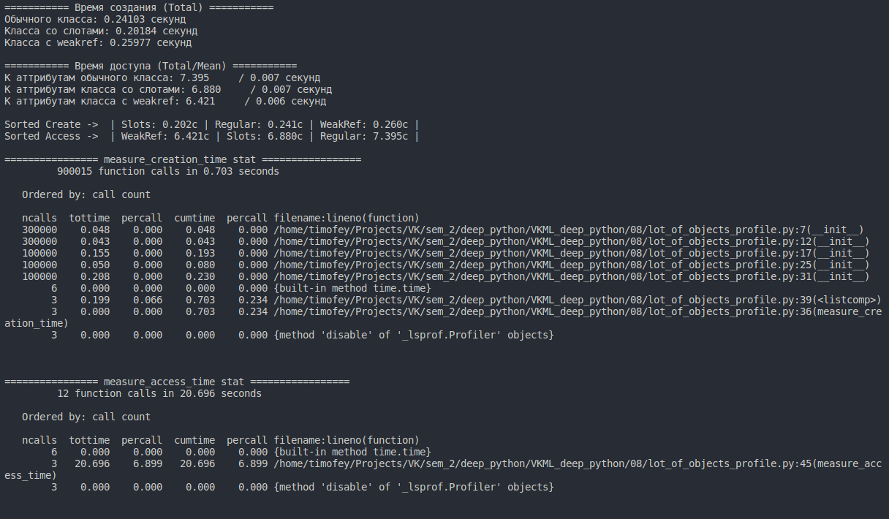

# Домашнее задание #08 (память, профилирование)

### 1 Сравнение использования weakref и слотов
В файле `lot_of_objects_profile.py` Были реализованы:
- класс с обычными атрибутами TeslaModel
- класс со слотами TeslaModelSlots
- класс с атрибутами weakref TeslaModelWeakRef

Для каждого из них было создано большое число экземпляров и проведены замеры времени создания и времени доступа

#### 1.1 Одиночный замер времени

Из рисунка видно
- по времени создания самый быстрый Slots, самый медленный WeakRef.
- по времени доступа к аттрибутам при этом WeakRef самый быстрый, а Regular (обычный класс) самый медленный.

#### 1.2 Проведем тестирование несколько раз

Из рисунка видно
- по времени создания самый быстрый Slots, самый медленный WeakRef.
- по времени доступа к аттрибутам при этом WeakRef самый быстрый, а Regular (обычный класс) самый медленный.

По времени доступа WekRef и Slots не сильно отличаются, Regular при этом явно медленнее (50%). Время создания при этом отличается на те же 50% между самым быстрым и самым медленным, но в меньших числах.
### 2 Профилирование
#### Проведем профилирование вызовов и памяти для кода из пункта 1.

#### Как видно из рисунка:
- Все методы init соответствующих классов вызвались в заданном числе созданных объектов
- Быстрее всего вызовы данного метода завершились у класса со слотами
- Медленнее всего вызовы произошли у класса weakref

Результаты подтверждают полученные в пункте 1

#### Как видно из рисунка:
- Первое создание объектов класса Regular заняло 52.5 MB
- Первое создание объектов класса Slots заняло 42.8 MB
- Первое создание объектов заняло WeakRef 31.5 MB
- Всего программа заняло 168.4 MB на создание всех объектов

То есть WeakRef занимает меньше всего памяти, в то время как Regular больше всего

### 3 Декоратор для профилирования

Статистика выводится корректно только в момент вызова метода `print_stat()` у функции, которой был применен декоратор, она корректно отсортирована.

Как видно, статистика выводится корректно и совпадает с полученной в пункте 2.

### 4 Код был прогнан линтерами black & ruff
